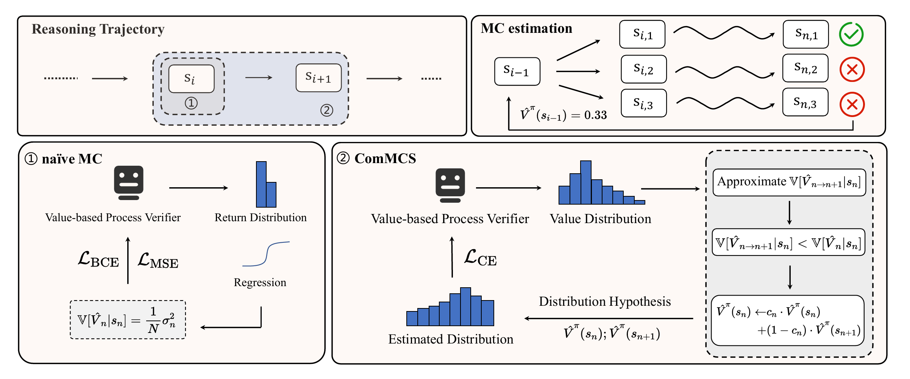
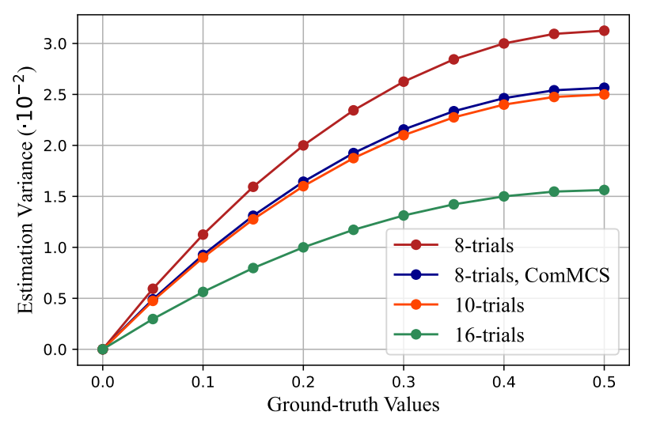
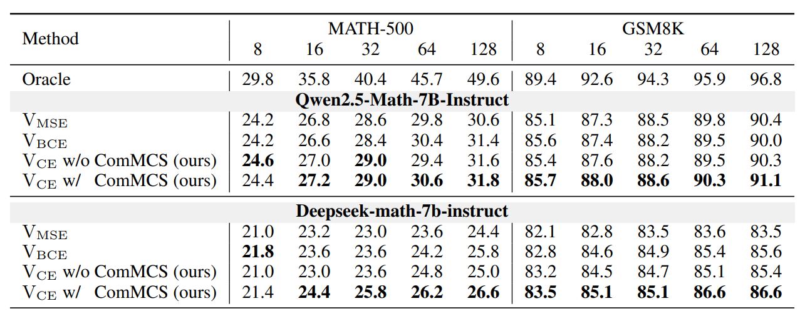
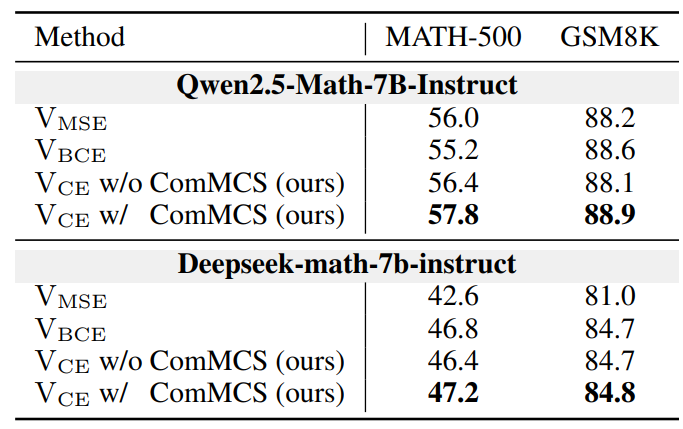

<div align="center">

<h2><a href="https://arxiv.org/abs/2508.10539">Improving Value-based Process Verifier via Low-Cost Variance Reduction</a></h2>

 <b> AAAI 2026 </b>


<!-- **Affiliations:** -->

_**[Zeitan Sun](https://scholar.google.com/citations?user=ToBoU8UAAAAJ), [Dongfang Li](https://crazyofapple.github.io/), [Baotian Hu](https://scholar.google.com/citations?user=5NiJ1VoAAAAJ), [Min Zhang](https://scholar.google.com/citations?user=CncXH-YAAAAJ)**_

Harbin Institute of Technology, Shenzhen

🚀 Welcome to the repo of **ComMCS**.

If you appreciate our project, please consider giving us a star ⭐ on GitHub to stay updated with the latest developments.</h2>

</div>

## 🎏 Overview

<div align=center></div>

**ComMCS** tries to reduce the sampling variance without introducing additional LLM inference cost when optimizing value-based process verifiers. ComMCS reshapes the output of process verifier as the one-step value distribution, and achieve the variance reduction via variance expression, variance approximation and variance comparison.


## 🌈 Results

The ComMCS method can approximately increase **25%** sampling efficiency.

<div align=center></div>


We perform experiments in GSM8K and MATH-500 on tasks including Best-of-N sampling and beam search.

<div align=center></div>

<div align=center></div>


## 🌟 Usage

### Prepare Environment

```bash
conda create -n commce python=3.11

pip install -r requirements.txt
```

### Train Verifier

```bash
bash scripts/run_verifier.sh
```

### Evaluation
```bash
cd best_of_n && python generate_samples.py && bash select_top.sh # For best-of-n experiments

cd beam_search && bash run_search.sh # For beam search experiments 
```

## 📚 Citation
If you find ComMCS useful for your research and applications, please cite using this BibTeX:
```bibtex
@misc{sun2025improvingvaluebasedprocessverifier,
      title={Improving Value-based Process Verifier via Low-Cost Variance Reduction}, 
      author={Zetian Sun and Dongfang Li and Baotian Hu and Min Zhang},
      year={2025},
      eprint={2508.10539},
      archivePrefix={arXiv},
      primaryClass={cs.AI},
      url={https://arxiv.org/abs/2508.10539}, 
}
```

