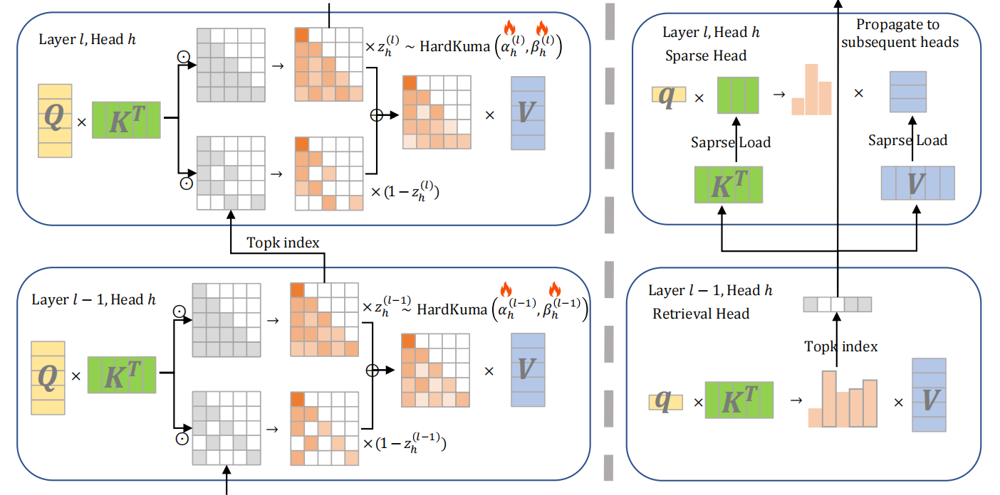
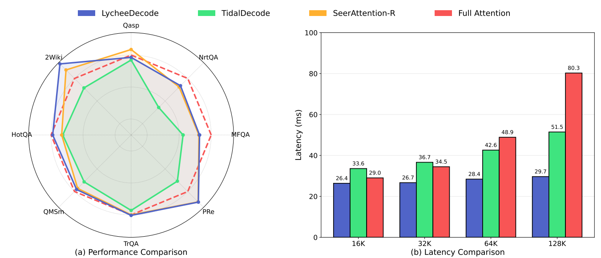

<div align="center">

<h2><a href="https://arxiv.org/abs/2602.04541">LycheeDecode: Accelerating Long-Context LLM Inference via Hybrid-Head Sparse Decoding</a></h2>

<b>ICLR 2026</b>


_**Gang Lin, Dongfang Li, Zhuoen Chen, Yukun Shi, Xuhui Chen, Baotian Hu, Min Zhang**_

Harbin Institute of Technology, Shenzhen


[](https://opensource.org/licenses/MIT)
[](https://www.python.org/downloads/release/python-3100/)
[](https://developer.nvidia.com/cuda-toolkit)


</div>

## 📖 Abstract

The proliferation of long-context large language models (LLMs) exposes a key bottleneck: the rapidly expanding key-value (KV) cache during decoding, which imposes heavy memory and latency costs. 

To address this, we propose **LycheeDecode**, an efficient decoding method centered on a fine-grained **Hybrid-Head** attention mechanism. Specifically, we employ a **HardKuma**-based mechanism to partition attention heads into:
1.  **🔍 Retrieval Heads:** A small subset that dynamically identifies crucial tokens using full attention.
2.  **⚡ Sparse Heads:** A majority subset that reuses the identified tokens for efficient computation.

By preserving the functional diversity of attention heads, LycheeDecode achieves generative quality comparable to the full-attention baseline while delivering significant speedups.

<div align=center>

</div>

## 🛠️ Installation

We recommend using Conda to manage the environment.

```bash
# Create environment
conda create -yn lychee python=3.10
conda activate lychee

# Install CUDA dependencies
conda install -y nvidia/label/cuda-12.4.0::cuda-toolkit
conda install -y nvidia::cuda-cudart-dev

# Install PyTorch
conda install -y pytorch==2.5.1 torchvision==0.20.1 torchaudio==2.5.1 pytorch-cuda=12.4 -c pytorch -c nvidia

# Install Python dependencies
pip install mkl==2024.0 transformers==4.56.1 datasets wandb matplotlib tilelang==0.1.5 einops zstandard rouge jieba fuzzywuzzy

# Install Flash Attention
pip install flash-attn==2.6.3 --no-build-isolation
```

## 🌟 Usage

### 1. Training Head Specialization

```bash
cd src/train

#  Prepare data
mkdir -p datasets
cd datasets
wget https://huggingface.co/datasets/togethercomputer/Long-Data-Collections/resolve/main/fine-tune/booksum.jsonl.zst
cd ..

# For Passkey Retrieval Dataset
bash train_kuma_multi_passkey.sh 

# For HotpotQA Dataset
bash train_kuma_hotpotqa.sh 
```

### 2. Evaluation: LongBench benchmark

```bash
# Prepare data
cd experiments/LongBench
wget https://huggingface.co/datasets/THUDM/LongBench/resolve/main/data.zip
unzip data.zip && rm data.zip

# Run benchmark
bash run_longbench.sh
```

### 3. Efficiency Benchmarks
```bash
# Kernel-level Efficiency
cd experiments/benchmark_kernel
bash kernel_efficiency.sh

# End-to-End Efficiency
cd experiments/benchmark_e2e
bash benchmark_e2e.sh
```

## 📊 Results

Experimental results on [Qwen3-8B](https://huggingface.co/Qwen/Qwen3-8B) and [
Llama-3-8B-Instruct-1048k](https://huggingface.co/gradientai/Llama-3-8B-Instruct-Gradient-1048k) confirm that LycheeDecode outperforms existing methods. It achieves the highest accuracy on [LongBench](https://github.com/THUDM/LongBench/tree/main/LongBench) while significantly reducing decoding latency across all tested context lengths (single batch).

<div align=center>

</div>

## 📚 Citation

If you find LycheeDecode useful for your research, please cite using this BibTeX:

```bibtex
@misc{lin2026lycheedecodeacceleratinglongcontextllm,
      title={LycheeDecode: Accelerating Long-Context LLM Inference via Hybrid-Head Sparse Decoding}, 
      author={Gang Lin and Dongfang Li and Zhuoen Chen and Yukun Shi and Xuhui Chen and Baotian Hu and Min Zhang},
      year={2026},
      eprint={2602.04541},
      archivePrefix={arXiv},
      primaryClass={cs.CL},
      url={https://arxiv.org/abs/2602.04541}, 
}
```

