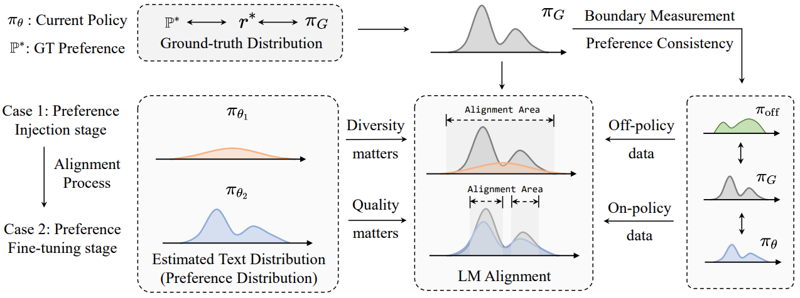
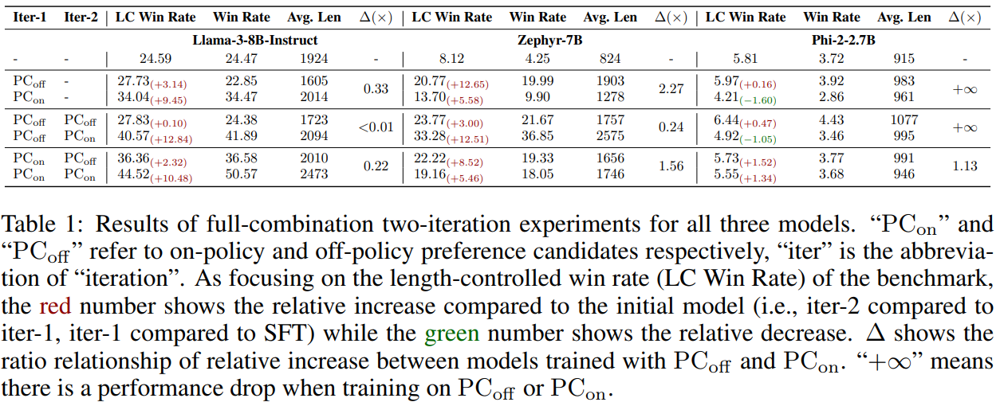
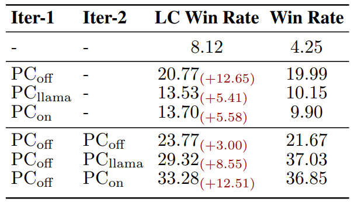
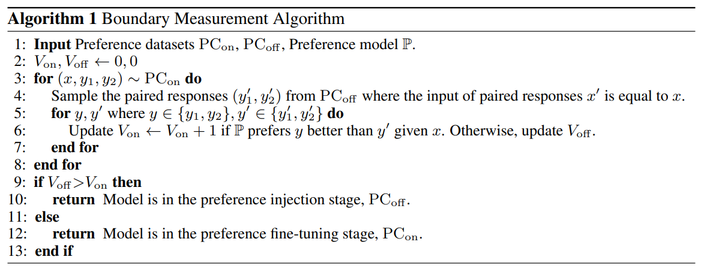
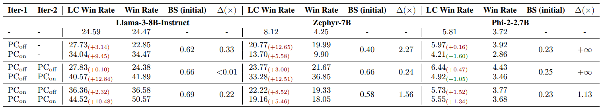
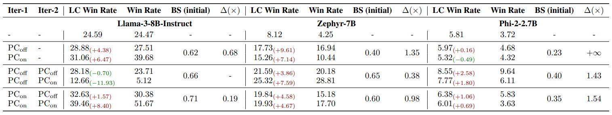
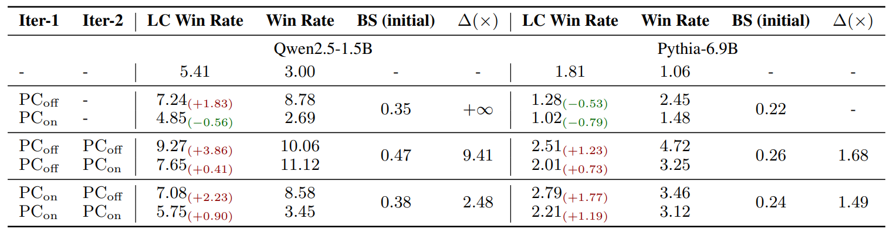

<div align="center">

<h2><a href="https://arxiv.org/abs/2508.10530v2">Is On-Policy Data always the Best Choice for Direct Preference Optimization-based LM Alignment?
</a></h2>

 <b> ICLR 2026 </b>


<!-- **Affiliations:** -->

_**[Zetian Sun](https://scholar.google.com/citations?user=ToBoU8UAAAAJ), [Dongfang Li](https://crazyofapple.github.io/), [Xuhui Chen](https://openreview.net/profile?id=~Xuhui_Chen3), [Baotian Hu](https://scholar.google.com/citations?user=5NiJ1VoAAAAJ), [Min Zhang](https://scholar.google.com/citations?user=CncXH-YAAAAJ)**_

Harbin Institute of Technology, Shenzhen

🚀 Welcome! If you appreciate our project, please consider giving us a star ⭐ on GitHub to stay updated with the latest developments.</h2>

</div>

## 🎏 Overview

<div align=center></div>

This work tries to model the dynamic requirements of preferences candidates during the Language Model (LM) alignemnt process, expecially optimizing LMs using contrastive alignment methods like Direct Preference Optimization (DPO). We reveal the effectiveness discrepancy between off-policy/on-policy data when optimizing different models, propose the **alignment stage assumption**, which divides the alignment process into two distinct stages: the preference injection stage, which benefits from diverse data, and the preference fine-tuning stage, which favors high-quality data. We provide the **boundary measurement algorithm**, which can help researchers and developers figure out the model's current stage in a cheap and proactive way.


## 🌈 Analysis

We train different models (llama3, zephyr and phi-2) using off-policy preference candidates and/or on-policy preference canditates for two iterations. For some models, trained with off-policy data can be better than can trained with on-policy data, and some others vice versa. 

<div align=center></div>

We focus on the two key characteristics of preference data: **intra-diversity** and **answer quality**, and construct the PC_llama dataset to de-confound the effects of data characteristics from their on-policy/off-policy nature. The results show that high diversity is more effective for models in the preference injection stage, and high quality will be more effective for models in the preference fine-tuning stage.

<div align=center></div>

We propose the Boundary Measurement Algorithm, which can predict the alignemnt state in a cheap and proactive way. 

<div align=center></div>

We perform experiments in two more models (qwen, pythia) and one more algorithm (SLiC-HF). The results fit the assuption well.

Check results of Llama-3, Zephyr, Phi-2 + DPO👇

<div align=center></div>

Check results of Llama-3, Zephyr, Phi-2 + SLiC-HF👇

<div align=center></div>

Check results of Qwen, Pythia + DPO👇

<div align=center></div>


## 🌟 Usage

### Prepare Environment

```bash
conda create -n commce python=3.11

pip install -r requirements.txt
```

### Prepare On-Policy Dataset:
```bash
bash scrpits/run_rerank_PairRM.sh # label preference by PairRM
```

### Prepare On-Policy Dataset:

```bash
bash scripts/run_sampling.sh  # sample on-policy preference candidates
bash scrpits/run_rerank_PairRM.sh  # label preference by PairRM
```

### Model Training:

```bash
bash scripts/run_sft.sh # for phi, qwen and pythia
bash scripts/run_train_dpo.sh # for all models
```

### Evaluation
```bash
bash scripts/run_alpaca_eval.sh
```

## 📚 Citation
If you find our work useful for your research and applications, please cite using this BibTeX:
```bibtex
@misc{sun2026onpolicydatabestchoice,
      title={Is On-Policy Data always the Best Choice for Direct Preference Optimization-based LM Alignment?}, 
      author={Zetian Sun and Dongfang Li and Xuhui Chen and Baotian Hu and Min Zhang},
      year={2026},
      eprint={2508.10530},
      archivePrefix={arXiv},
      primaryClass={cs.AI},
      url={https://arxiv.org/abs/2508.10530}, 
}```

